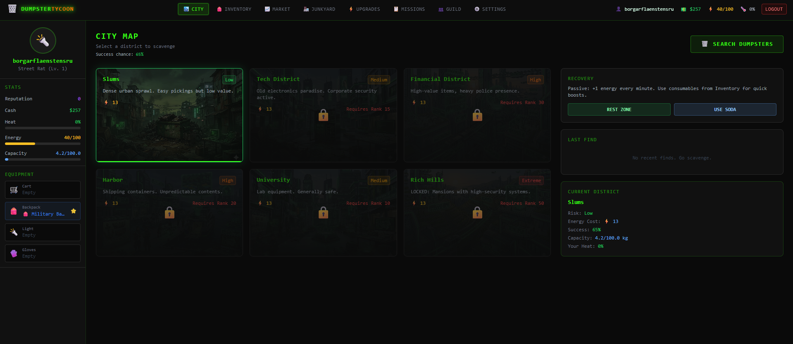

# Dumpster Tycoon

Dumpster Tycoon is a browser-based scavenging and junk-economy game built with Next.js, React, Zustand, Prisma, and NextAuth. The current build now covers the core scavenging loop, inventory and equipment, authenticated persistence, live market trading, junkyard management, and the opening Sprint 6 progression tree systems.



## Current State

The project is fully through Sprint 5.5 of the roadmap, and Sprint 6 has started.

Implemented so far:

- Core scavenging loop across multiple city districts
- Inventory management, item tooltips, equipment, recycling, and disassembly flows
- Persistent user accounts with Discord, Google, and email/password auth
- Account linking across providers that share the same email
- Profile settings with account stats, provider management, password add/update, and sign-out
- Email verification, forgot-password, reset-password, and recovery flows
- User-scoped persistence for gameplay state using Prisma + SQLite
- Marketplace buy/sell flows, auction house listings, direct peer trades, and escrow-backed settlement
- Junkyard storage, timed recycling jobs, worker assignment, facility upgrades, and junkyard revenue stats
- Store-backed upgrade trees with rank progress, resource gates, achievements, and progression leaderboards
- Automated test coverage for auth flows, profile routes, store logic, and key page states

## Stack

- Next.js 16 App Router
- React 19
- Zustand for client gameplay state
- Prisma + SQLite for persistence
- NextAuth for authentication
- Vitest + Testing Library for automated tests
- Framer Motion for UI transitions

## Running Locally

1. Install dependencies:

```bash
npm install
```

2. Configure environment variables in `.env`.

Minimum local auth setup:

```env
DATABASE_URL="file:./dev.db"
NEXTAUTH_URL="http://localhost:3000"
AUTH_SECRET="change-this-before-production"
AUTH_GOOGLE_ID=""
AUTH_GOOGLE_SECRET=""
AUTH_DISCORD_ID=""
AUTH_DISCORD_SECRET=""
```

3. Sync Prisma:

```bash
npm run prisma:generate
npm run prisma:push
```

4. Start the app:

```bash
npm run dev
```

## Testing

Run the automated suite:

```bash
npm test
```

Run a production build check:

```bash
npm run build
```

Notes about auth testing:

- SMTP is optional in local development.
- When SMTP is not configured, verification and password-reset flows return local preview URLs instead of sending mail.
- The current test suite uses that preview-link behavior to validate recovery flows without a mail provider.

## Auth Features

- Discord OAuth sign-in
- Google OAuth sign-in
- Email/password registration and login
- Email verification for password accounts
- Forgot-password and reset-password flows
- Linked-account recovery rules for revoked provider access
- Provider-aware settings UI with password add/update support

## Upcoming Todos

The next major work is already laid out in `sprints.md`. The highest-priority open items are:

- Finish the remaining Sprint 6 resource-gate and upgrades-page polish items
- Tie more progression systems to the user record: unlocked districts, missions, and guild membership
- Add optimistic update + rollback behavior when persistence fails
- Finalize account migration strategy for existing local-only players
- Complete QA around session refresh, logout/login, expired sessions, and account isolation
- Confirm Sprint 1 and Sprint 2 gameplay still behaves correctly under persisted authenticated state
- Continue from progression into missions, contracts, and faction systems

## Short Roadmap

### Sprint 6: Progression & Upgrade Trees

- Store-backed linear upgrade trees for transport, equipment, lighting, and storage
- Rank progress tied to lifetime scavenged value
- Resource-gated upgrade purchases with junkyard material costs
- Progression achievements and leaderboard scaffolding

### Sprint 7: Missions & Contracts

- Daily mission generation and contract rewards
- Multi-step chains and faction-sensitive outcomes
- Seasonal leaderboard hooks

## Repository Notes

- Main roadmap and sprint tracker: `sprints.md`
- Auth and session configuration: `src/auth.ts`
- Gameplay state store: `src/store/gameStore.ts`
- Profile persistence API: `src/app/api/profile/route.ts`
- Account settings UI: `src/pages-ui/SettingsPage.tsx`
- Upgrade tree UI: `src/pages-ui/UpgradesPage.tsx`

## Status

This repository is under active iteration. The current focus is finishing Sprint 6 progression work before moving into missions and contract systems.
